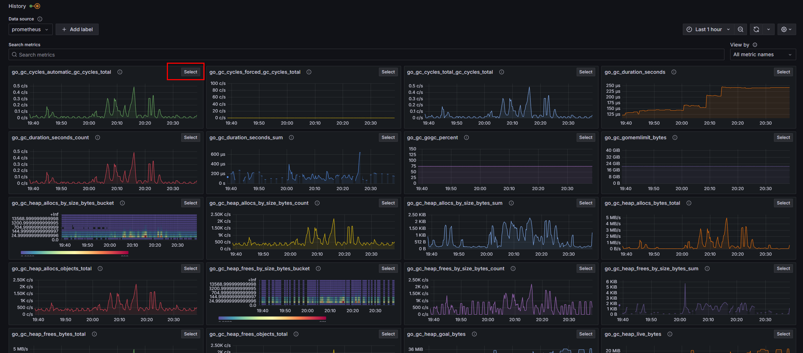

# Grafana Homework
## Table of Contents

1. [Introduction](#introduction)
2. [Prerequisites](#prerequisites)
3. [Setting Up the Environment](#setting-up-the-environment)
   - [Installing Docker](#installing-docker-centos-9)
   - [Generating TLS Certificates for Prometheus server (Optional)](#generating-tls-certificates-for-prometheus-server-optional)
4. [Install And Run Prometheus](#install-and-run-prometheus)
5. [Install OTEL and Loki using Docker compose](#install-otel-and-loki-using-docker-compose)
6. [Create Dashboard](#create-a-dashboard)
7. [View Image Directory](images)

---

## Introduction

This readme will walk you through:
- Grafana account
- Installing and Configuring Prometheus
- Installing and Configuring Loki
- Installing and Configuring OTEL
- Creating a Grafana Dashboard

## Prerequisites

Before starting, ensure you have:
- A Linux system (physical or virtual)
- Docker/Podman Installed
- An understanding of containerization and linux commandline

---

## Setting Up the Environment

### Installing Docker (CentOS 9)
```bash 
yum install podman
yum install podman-compose
```

### Generating TLS Certificates for Prometheus server (Optional)
The file openssl.cnf can be found in the prometheus folder of this repository.  A basic openssl configuration file has been used for this example.
```bash
cd <project root directory>
mkdir pki && cd pki
mv ../openssl.cnf .
mkdir -p certs crl newcerts private
touch index.txt
```
`echo A9F3C8E1D6B7A54200001234 > serial                          #create a serial file for uniqueness`  
```bash 
#generate a private key
openssl genrsa -out private/ca.key 4096     
```

```bash
#create a self-signed cert using the key, cnf file   
openssl req -x509 -new -key private/ca.key -days 3650 -out certs/ca.crt -config openssl.cnf -extensions v3_ca
```

``` bash
#create a private key for the prometheus server
openssl genrsa -out server.key 2048                            
```

``` bash
#create a certificate signing request for the server
openssl req -new -key server.key -out server.csr -config openssl.cnf
```

``` bash
#Generate a signed certificate for prometheus
openssl ca -config openssl.cnf -in server.csr -out server.crt -extensions v3_req           
```


## Install and Run Prometheus

#### Reference File: web-confi.yml
```yaml
# web-config.yml
tls_server_config:
  cert_file: "/etc/prometheus/certs/server.crt"
  key_file: "/etc/prometheus/certs/server.key"
```

#### Reference File: prometheus.yml
```yaml
# prometheus.yml

global:
  scrape_interval: 15s # Set the scrape interval to every 15 seconds. Default is every 1 minute.
  evaluation_interval: 15s # Evaluate rules every 15 seconds. The default is every 1 minute.
  # scrape_timeout is set to the global default (10s).

# Alertmanager configuration
alerting:
  alertmanagers:
    - static_configs:
        - targets:
          # - alertmanager:9093

# Load rules once and periodically evaluate them according to the global 'evaluation_interval'.
rule_files:
  # - "first_rules.yml"
  # - "second_rules.yml"

# A scrape configuration containing exactly one endpoint to scrape:
# Here it's Prometheus itself.
scrape_configs:
  # The job name is added as a label `job=<job_name>` to any timeseries scraped from this config.
  - job_name: "prometheus"

    # metrics_path defaults to '/metrics'
    # scheme defaults to 'http'.

    static_configs:
      - targets: ["192.168.0.230:9100"]

remote_write:
- url: "https://prometheus-prod-36-prod-us-west-0.grafana.net/api/prom/push"
  basic_auth:
    username: <your username>
    password: "<your api key>"

```
```bash
# NOTE: Be sure to add in your username and API key to prometheus.yml prior to continuing

sudo podman pull docker.io/prom/prometheus:latest
sudo podman run -d -p 9090:9090 -v ./pki/:/etc/prometheus/certs:z -v ./web-config.yml:/etc/prometheus/web-config.yml:z --name prom prom/prometheus --web.config.file=/etc/prometheus/web-config.yml --config.file=/etc/prometheus/prometheus.yml
```

### Adding your Root CA to the browser


### Installing Loki
```bash
mkdir loki
cd loki
wget https://raw.githubusercontent.com/grafana/loki/v3.0.0/cmd/loki/loki-local-config.yaml -O loki-config.yaml
wget https://raw.githubusercontent.com/grafana/loki/v3.0.0/clients/cmd/promtail/promtail-docker-config.yaml -O promtail-config.yaml
docker run --name loki -d -v $(pwd):/mnt/config -p 3100:3100 grafana/loki:3.2.1 -config.file=/mnt/config/loki-config.yaml
docker run --name promtail -d -v $(pwd):/mnt/config -v /var/log:/var/log --link loki grafana/promtail:3.2.1 -config.file=/mnt/config/promtail-config.yaml
```
#### Note: If issues with permission errors while reading the configuration files from within the container, you may need to temporarily disable or adjust your SELinux settings.


### OR
### Install OTEL and Loki using Docker compose
``` bash
git clone -b microservice-otel-collector  https://github.com/grafana/loki-fundamentals.git
docker compose -f loki-fundamentals/docker-compose.yml up -d
docker ps -a

```

## Create A Dashboard
### Nagivate to your Grafana instance being ran by docker (your IP will be different) 
http://192.168.0.230:3000/a/grafana-lokiexplore-app/explore

### Explore the Metrics


### Choose a graph you like


### Click "View In Explorer"


### Add the graph to a Dashboard


### Select Existing or Createa a new Dashboard


### Collect multiple graphs to create a dashboard


### Other pre-made dashboards can be utilized easily


### Summary
During this project, I came across a few issues related to SELinux causing configration files to have permission errors within the containers.  I also ran into some obsticles related to the configuration of TLS that required research to resolve, mostly related to syntax and configuration options within the openssl.cnf file.  Other than those two items, the learning curve was smooth and not too bad.
